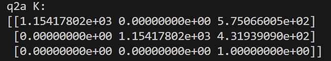
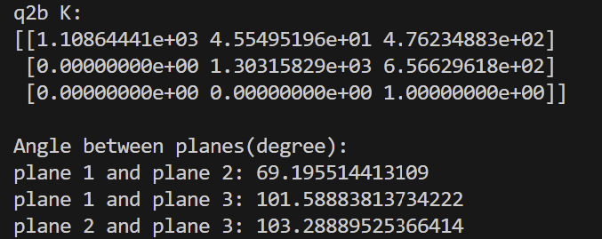

# HW2: Single-view Reconstruction

## Q1:  Camera matrix `P` from 2D-3D correspondences (30 points)

### (a) Stanford Bunny (15 points)
Given 2D-3D point correspondences in `data/q1/bunny.txt`. The text file contains multiple rows. Each row represents a pair of 2D-3D correspondences, where the first 2 numbers are the 2D coordinates on the image while the next 3 numbers are the corresponding 3D coordinates.

 1. Compute camera matrix `P` using the provided 2D-3D correspondences.

 

  | Surface Points  | Bounding Box |
  | ----------- | ----------- | 
  |    |  | 
  
 2. Description: we know that 3d point tranform to 2d though projection matrix, Form matrix A using xi and Xi. P will be flattened, we can stack each correspondence into A, then we can find the SVD of A and use the last column of V to minimize the expression. We can then reshape P back to a 3x4 matrix.

An additional normalization step must be included to obtain an accurate P. A similarity transform is used to center and normalize both the 3D and 2D points.
### (b) Cuboid (15 points)
 1. Compute the camera matrix `P` using your annotated 2D-3D correspondences.

  

  | Input Image  | Annotated 2D points | Example Result |
  | ----------- | ----------- | ----------- | 
  |    |  |  

 2. Description: The algorithm described in part (a) is implemented in the code and obtains the P below. Using this P, the code calculates the 2D pixel coordinates of all the line endpoints and displays the below image.

## Q2: Camera calibration `K` from annotations (40 points + 10 points bonus)
### (a) Camera calibration from vanishing points (20 points)
The goal is to compute `K` from a triad of orthogonal vanishing points, assuming that the camera has zero skew, and that the pixels are square. 

  1. Output plots of the vanishing points and the principal point.
  
  | Input Image  | Annotated Parallel Lines | Vanishing points and principal point |
  | ----------- | ----------- | ----------- |
  |    |  |  |
    
  2. 
  3. Brief description of implementation: Since we assume square pixels, only 3 vanishing points are required to calculate the intrinsics, K, of the camera. These vanishing points are provided by the given annotations: 3 mutually orthogonal pairs of parallel lines. The vanishing point of each pair was found and is displayed in the below image. The vanishing lines between them were also found. The projection of each vanishing point onto the vanishing line opposite it was plotted and their intersection displays the principal point of the image. We know that mutually orthogonal vanishing points must obey V^TWV=0. To find K, we first try to find w,The pairs of vanishing points provide 3 constraints, which can be reformulated into an Ax=0  problem, where A is the stacked constraints and x is the flattened. The SVD of A can be found and the last column of V can be used as x, which we can use to construct w. Once we have w, we can use the Cholesky decomposition to determine K

  
### (b) Camera calibration from metric planes  (20 points)
In this question, your goal is to compute `K` from image of three squares. Different from (a), you will not make any additional assumption on `K` (except that it is a projective camera). 

  1. Visualizations of annotations. 
  
  | Input Image  | Annotated Square 1 | Annotated Square 2 | Annotated Square 3 | 
  | ----------- | ----------- | ----------- |  ----------- |
  |    |  |   |   |
    
  2 & 3. Evaluate angles between each pair of planes and report K
  
 
    
  4. Brief description of your implementation: The annotated 2D points of 3 different perspective squares are given. Metric cooridnates are assigned for each square's corners, as though the square was shown without perspective. For each square, the homography, H =[h1, h2, h3] that converts the metric points to the annotated corners is computed. This gives us the following constraints for each square: h1.T W h2 =0, h1.T W h1- h2.T W h2 =0. These constraints can be formulated into an Ax=0 problem with x representing w. The SVD of A can be found and the last column of V can be taken as x, which allows us to reconstruct w. The value of K can then be determined by Cholesky decomposition of w 

## Q3: Single View Reconstruction (30 points + 10 points bonus)
In this question, your goal is to reconstruct a colored point cloud from a single image.

### (a) (30 points)
  1. Output reconstruction from at least two different views. Also include visualizations of annotations:
  
  | Input Image  | Annotations | Reconstruction View 1 | Reconstruction View 2 | 
  | ----------- | ----------- | ----------- |  ----------- |
  |    |  |   |   |
  
  2. Brief description of your implementation (i.e., the algorithm followed with relevant equations).
    1. Use Q2a to compute `K`.
    2. Annotate plane boundaries with corner points.
    3. Compute plane normals.
    4. Compute rays for each point. Pick one point as reference and set its depth. 
    5. Compute plane equation given the known 3D point.
    6. Compute 3D coordinate of all points on the plane via ray-plane intersection.
    7. Repeat the above two steps to obtain equations for all planes (and all 3D points).
     We assume square pixels and compute K as in Q2a. The given annotations of plane boundaries for 5 planes are used. The vanishing lines of each plane are computed. The normal direction of each plane is computed with the equation l x wv=0, where l is the vanishing line of the plane and v is the normal direction vector. The expression is reformulated as Ax = 0 and v is determined by SVD. Once v is normalized, it becomes the unit normal vector of its plane. Once all the plane normals are computed, we can calculate the rays of each annotated point on the image as d =Kinv x. Each ray is made a unit vector as soon as it's computed. We set the depth of a single reference point by multipliying its ray by the scalar depth and taking that as its 3D point. The camera center and orientation is taken as the world frame for all 3D points. Now that we have a reference 3D point, we can take every 2D pixel within the plane and find its 3D point. We first find D. Once all these 3D points are found, they are plotted in a scatterplot with their original color from the input image.

