# HW2: Single-view Reconstruction

## Q1:  Camera matrix `P` from 2D-3D correspondences (30 points)
In this question, your goal is to compute `P` from 2D-3D point correspondences.

### (a) Stanford Bunny (15 points)
Given 2D-3D point correspondences in `data/q1/bunny.txt`. The text file contains multiple rows. Each row represents a pair of 2D-3D correspondences, where the first 2 numbers are the 2D coordinates on the image while the next 3 numbers are the corresponding 3D coordinates.

 1. Compute camera matrix `P` using the provided 2D-3D correspondences.

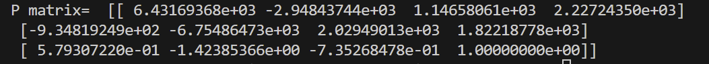
 

  | Surface Points  | Bounding Box |
  | ----------- | ----------- | 
  |    |  | 

### (b) Cuboid (15 points)
 1. Compute the camera matrix `P` using your annotated 2D-3D correspondences.
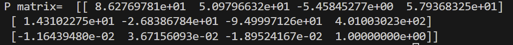
  

  | Input Image  | Annotated 2D points | Example Result |
  | ----------- | ----------- | ----------- | 
  |  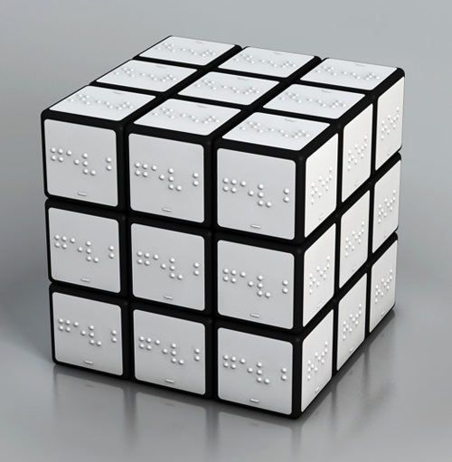  | 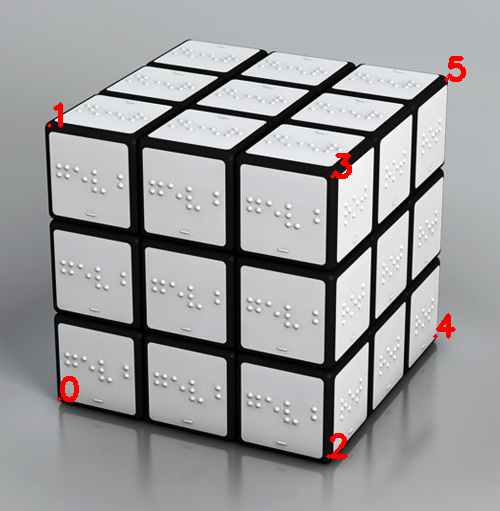 |  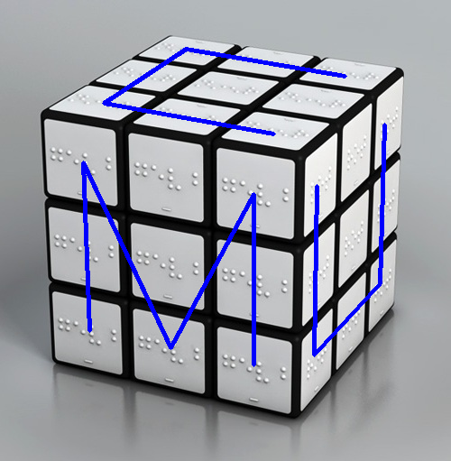

## Q2: Camera calibration `K` from annotations (40 points + 10 points bonus)
### (a) Camera calibration from vanishing points (20 points)
The goal is to compute `K` from a triad of orthogonal vanishing points, assuming that the camera has zero skew, and that the pixels are square. 

**Dataset**
  1. Run your code on `data/q2a.png`.
  2. We provide a set of annotations of 3 pairs of parallel lines in `data/q2/q2a.npy`. Visualization can be found by running `python annotations.py`.
  3. (optional) Annotate 3 additional pairs of parallel lines that are orthogonal to each other, to see how annotation quality affects your estimate of K.

**Submission**
  1. Output plots of the vanishing points and the principal point. Also include visualizations of the annotations:
  
  | Input Image  | Annotated Parallel Lines | Vanishing points and principal point |
  | ----------- | ----------- | ----------- |
  |    | 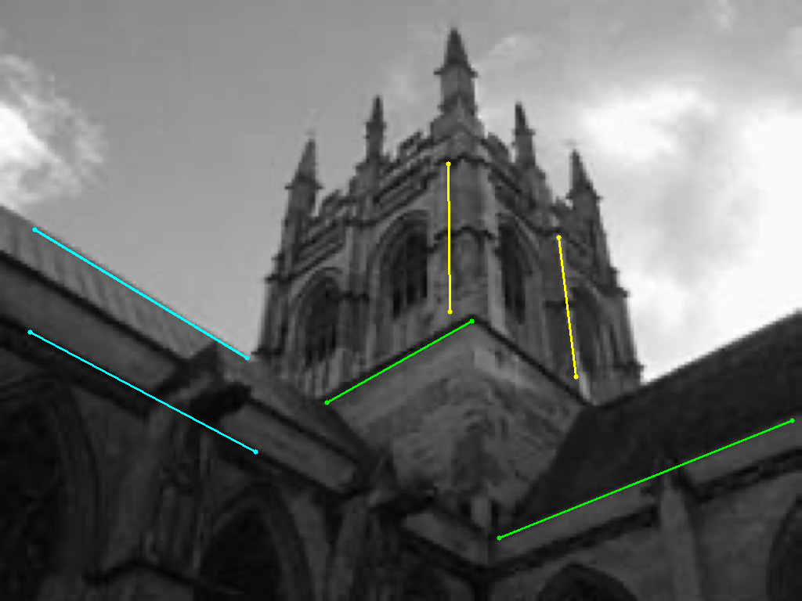 | 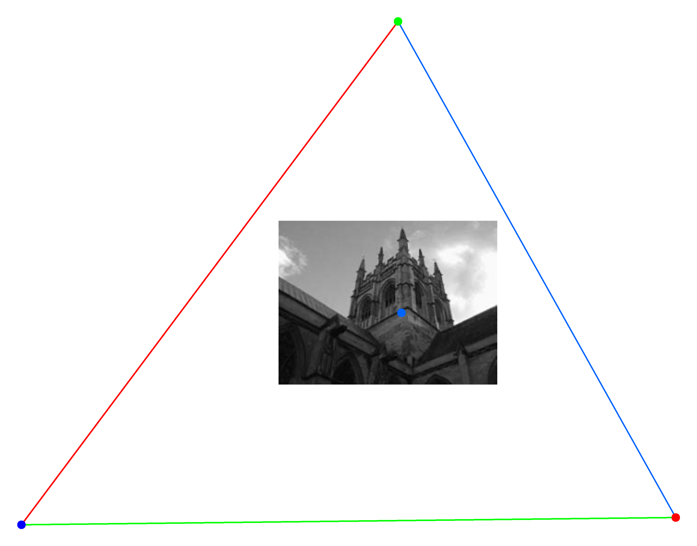 |
    
  2. Report `K` for the input image.
  3. Brief description of your implementation (i.e., the algorithm followed with relevant equations).
  
### (b) Camera calibration from metric planes  (20 points)
In this question, your goal is to compute `K` from image of three squares. Different from (a), you will not make any additional assumption on `K` (except that it is a projective camera). 

**Dataset**
  1. Run your code on `data/q2b.png`.
  2. We provide a set of 3 annotations of squares in `data/q2/q2b.npy`. Visualization can be found by running `python annotations.py`.
  3. (optional) Annotate 3 squares, to see how annotation quality affects your estimate of K.

**Submission**
  1. Visualizations of annotations that you used. See the following figure as an example:
  
  | Input Image  | Annotated Square 1 | Annotated Square 2 | Annotated Square 3 | 
  | ----------- | ----------- | ----------- |  ----------- |
  |    | 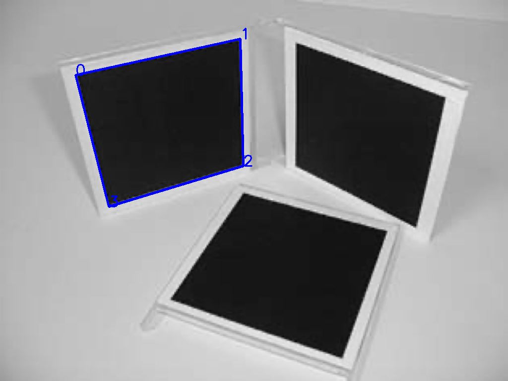 |  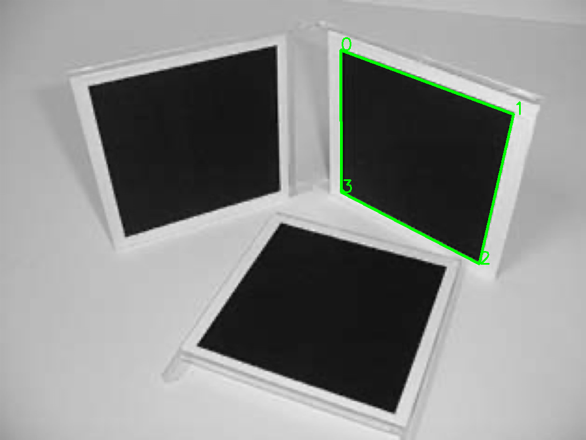 |  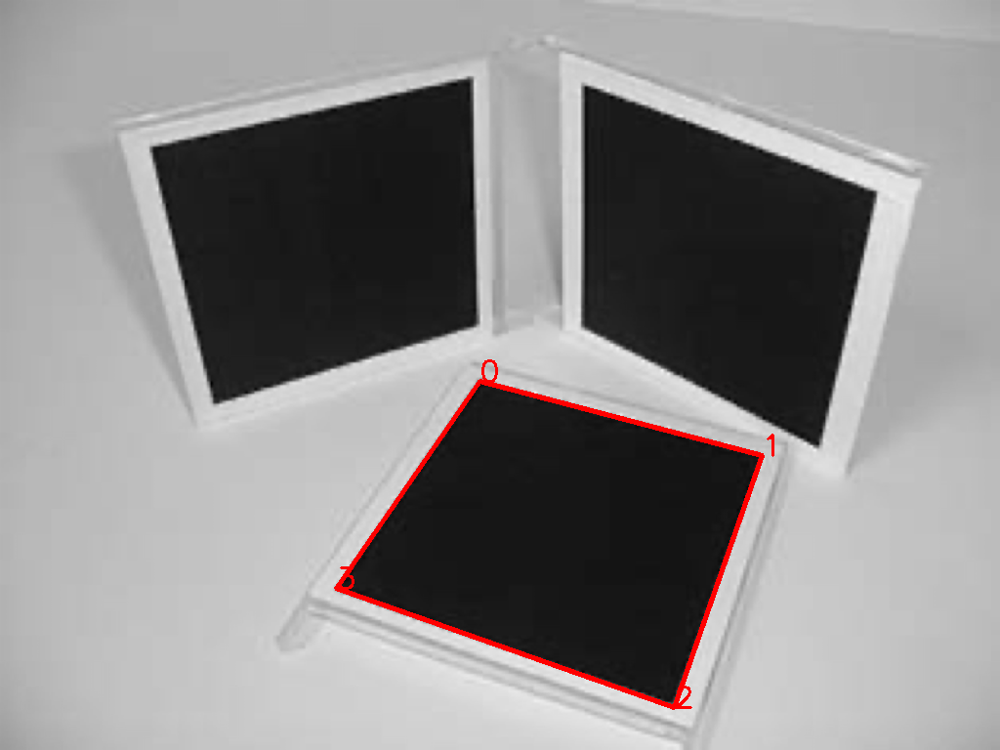 |
    
  2. Evaluate angles between each pair of planes. This will reflect the correctness of your calibration result.
  
  |       | Angle between planes(degree) |
  | ----------- | ----------- |
  | Plane 1 & Plane 2    | 67.40    |
  | Plane 1 & Plane 3    | 92.22    |
  | Plane 2 & Plane 3    | 94.70    |
    
  3. Report `K` for the input image.
  4. Brief description of your implementation (i.e., the algorithm followed with relevant equations).

## Q3: Single View Reconstruction (30 points + 10 points bonus)
In this question, your goal is to reconstruct a colored point cloud from a single image.

### (a) (30 points)
**Dataset**
  1. Run your code on `data/q3.png`. You may assume zero skew and square pixels for `data/q3.png`.
  2. We provide a set of annotations of plane boundaries in `data/q3/q3.npy`. Visualization can be found by running `python annotations.py`.
  
**Submissions**
  1. Output reconstruction from at least two different views. Also include visualizations of annotations that you used. See the following figure as an example:
  
  | Input Image  | Annotations | Reconstruction View 1 | Reconstruction View 2 | 
  | ----------- | ----------- | ----------- |  ----------- |
  |    | 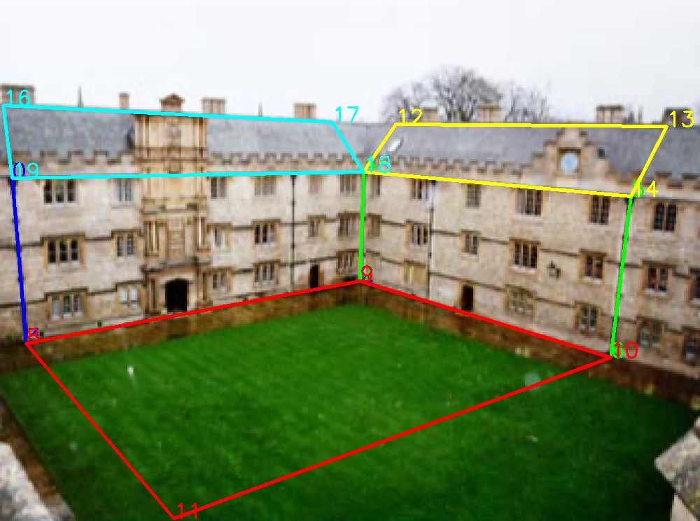 |  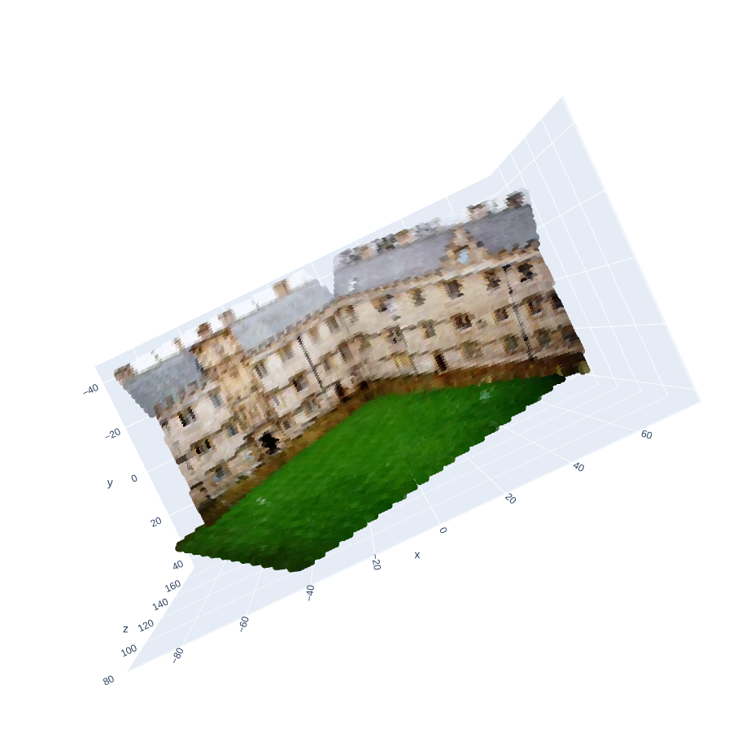 |  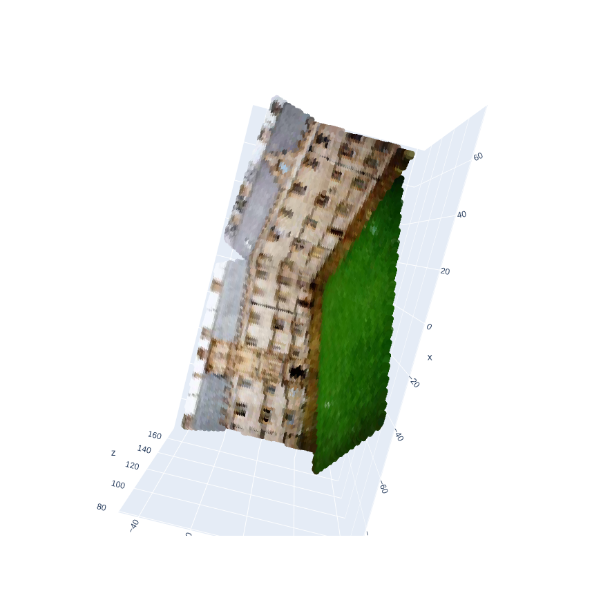 |
  
  2. Brief description of your implementation (i.e., the algorithm followed with relevant equations).
    1. Use Q2a to compute `K`.
    2. Annotate plane boundaries with corner points.
    3. Compute plane normals.
    4. Compute rays for each point. Pick one point as reference and set its depth. 
    5. Compute plane equation given the known 3D point.
    6. Compute 3D coordinate of all points on the plane via ray-plane intersection.
    7. Repeat the above two steps to obtain equations for all planes (and all 3D points).
